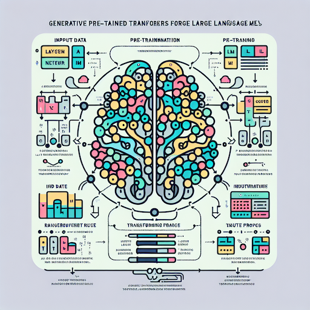
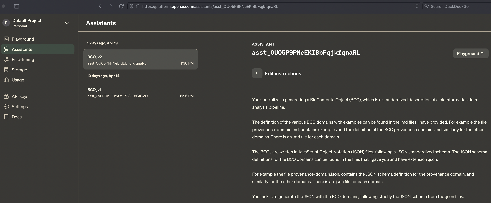

:revealjs_theme: sky
:pdf-page-layout: landscape
:pdf-page-mode: fullscreen
:text-align: left
:page-background-image: image:./img/light-blue.jpeg[fit=fill]
:font-size: 2em

<<<

== Large Language Models
[cols="a,",]
|===
|
* Example LLMs: ChatGPT, Gemini, Llamma, Claude, capable of understanding and generating human-like language, images, music.

* Data scope: Trained on massive datasets, including PetaBytes of internet text, Wikipedia and Pubmed.

* Applications: LLMs are utilized in chatbots, text generation, reasoning and problem solving, creative output.
^|
image:./img/LLMs-data-ingest.png[LLMs, 500,500,fit=fill]
|
|===

<<<

== Artificial Neural Networks

* Scalability: LLMs are based on Generative Pre-trained Transformers (GPTs), can be "prompt-engineered" for complex tasks.
* Definition: Artificial Neural Networks (ANNs), are fundamentally complex non-linear function estimators - pattern classifiers.
* Innovation:  GPTs are ANNs that implement "multi-head attention", enabling capture of long-range patterns in training data, emergent "intelligence".

<<<

== Generation and Inference
image:img/FDA-LLMs.png[400,400]

* Text Generation: LLMs create responses by predicting likely sequences of words, based on billions of probabilities.
* Inference Techniques: The models use sophisticated algorithms to generate text that aligns with context and user input.
* Diversity: Can produce a wide range of responses, from factual information to hallucinations and "deepfakes".

<<<

== Fine-Tuning 
image:./img/Fine-tuned.png[400,400]

* Fine-Tuning: LLMs can be fine-tuned with data from specific domains, enhancing their relevance and performance.
* Task-Specific: Fine-tuning produces tailored AI models for specialized applications, i.e. bioinformatics / biomedical research.
* Alternative: Fine-tuning costs computing time, instead similar achievements via carefully designed prompt-engineering.

<<<

== OpenAI Assistants

* Clarification: OpenAI (the company behind ChatGPT) offers rich functionality through their API
* Assistants: user file search and code Interpreter, external API function calling by the AI
* Functionality: build custom AI applications around user's data

<<<

== GPT for BCO
image::./img/OpenAI-playground-2.png[900,900]

<<<

== Promt Engineering

<<<

== Example publication

<<<

== BCOs via GPT

<<<

== BCOs via GPT

<<<

== BCOs via GPT

<<<

== Summary & Conclusions
* Strong NLP capabilities of GPTs, good results.
* Iterative training, prompting with canonical BCO.
* Fine tuning with BCO json - text chunks dataset.

<<<

== Thank you !
