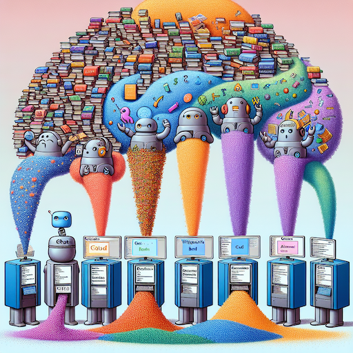

== Large Language Models (LLMs)

== Large Language Models (LLMs)
[%step]
* Definition: LLMs are AI models capable of understanding and generating human-like language.
* Examples: ChatGPT, Gemini, Bard, Llamma, Claude, Mistral etc. represent state-of-the-art LLMs.
* Scope: Trained on massive datasets, i.e. PetaBytes of text from the internet, complete wikipedia and Pubmed
* Applications: LLMs are used in chatbots, virtual assistants, text generation, and more.

== Transformer Neural Networks
image::./img/GPTs.png[]

== Transformer Neural Networks
[%step]
* Architecture: Generative Pre-trained Transformers (GPTs) are the foundational architecture for LLMs.
* Efficiency: The architecture allows for parallel processing of input data, "multi-head attention".
* Innovation: GPTs have revolutionized NLP with their ability to capture long-range dependencies in text.
* Scalability: The GPTs are Artificial Neural Networks (ANNs)  that can be "prompt-engineered" for complex tasks.

== Contextual Understanding
image::./img/contextual-understanding.png[]

== Contextual Understanding
[%step]
* Definition: Contextual understanding refers to the ability of a model to understand the context of a given input.
* Relevance: LLMs generate responses based on the context of the user input text, allowing for coherent interactions.
* Dynamic Context: The models can maintain context across multiple exchanges, enabling more meaningful conversations.
* Language Comprehension: LLMs understand a wide range of linguistic constructs, from idiomatic expressions to domain-specific jargon.
* Adaptability: Capable of adjusting responses based on user feedback and ongoing context.

== Generation and Inference

== Generation and Inference
[%step]
* Text Generation: LLMs create responses by predicting likely sequences of words, based on probabilities.
* Inference Techniques: The models use sophisticated algorithms to generate text that aligns with context and user input.
* Diversity: Can produce a wide range of responses, from factual information to creative content.
* Quality Control: LLMs incorporate mechanisms to ensure responses are coherent and contextually appropriate.

== Fine-Tuning and Adaptation
image::./img/Fine-tuned.png[]

== Fine-Tuning and Adaptation
[%step]
* Fine-Tuning: The models can be fine-tuned to improve their performance on a specific task.
* Customization: LLMs can be fine-tuned for specific domains or tasks, enhancing their relevance and performance.
* Task-Specific: Fine-tuning allows for specialized applications, such as customer support or technical assistance.
* Performance Gains: Tailored models often exhibit improved accuracy and relevance for particular use cases.
* Continuous Learning: Fine-tuning is an ongoing process, allowing models to adapt to evolving requirements and data trends.