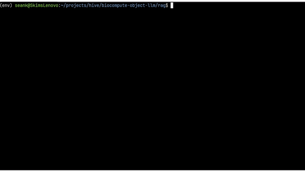

# Custom Retrieval Augmented Generation (RAG) Approach

## Documentation

- [Installation and Setup](./docs/installation.md)
- [Usage](./docs/usage.md)
- [Future Direction](./docs/future.md)

## Approach Justification and Background

This BioCompute Object (BCO) assistant will assist users in automatically creating specific BCO domains from user uploaded papers. This proof of concept uses a **Retrieval Augmented Generation** ([RAG](https://arxiv.org/abs/2005.11401)) approach rather than a standalone (or fine-tuned) large language model (LLM). Our use case is somewhat antithetical to what LLMs were originally designed for. LLMs were designed for creative, free text responses that represent plausible natural language. BCOs, on the other hand, were designed for accurate, non-ambiguous, reproduceable documentation. Given this, there are two main initial questions that have to be considered:

- Current LLMs are often categorized as "stochastic parrots" that have no underlying understanding of text structure, only generating what are considered plausible natural language respones. How well could LLMs consistently produce structured, schema compliant JSON responses (regardless of the actual output content)? 
- Unlike traditional LLM use cases, the goal of BCOs as described above, are not to generate creative and original output. How can we constrain the LLM to limit creativity, extrapolation, and potentially subjective output? 

Given these considerations and our use case, a traditional standalone LLM suffers from multiple drawbacks in our problem context.

### Issues with Long Context Windows

Recent studies ([Lost in the Middle](https://cs.stanford.edu/~nfliu/papers/lost-in-the-middle.arxiv2023.pdf)) have shown that LLM's can struggle with long contexts: 

> ... performance can degrade significantly when changing the position of relevant information, indicating that current language models do not robustly make use of information in long input contexts. In particular, we observe that performance is often highest when relevant information occurs at the beginning or end of the input context, and significantly degrades when models must access relevant information in the middle of long contexts, even for explicitly long-context models.

This issue is particularly important for our expected user workflow. If a user uploads a particularly long paper, ingesting the entire paper as part of our context window will likely result in significantly variant output quality on a per domain basis. For example, the usability domain information is usually contained in the paper abstract, which is usually at the beginning of the paper and as a result, will be earlier in the context window. In this case, the generated usability domain is more likely to contain quality information whereas the description domain captures specific workflow information that is usually contained in the middle of a paper. In this case, if the required information is on page 5 of a 10 page paper, we can expect lower quality information in the generated description domain. The RAG will help ensure that our context window stays manageable, by avoiding complete ingestion of the paper in one-shot. Instead, the paper will be indexed and intelligently queried prior to each prompt to ensure our context window is manageable, precise, and relevant.

### Training Data and False Extrapolation

LLMs are also highly sensitive to the quality of the training data. A study from Microsoft Research titled [Textbooks Are All You Need](https://arxiv.org/pdf/2306.11644.pdf) demonstrated the impact of high-quality training data in output quality, specifically with regard to proficiency in code-generation tasks. 

> By crafting "textbook quality" data we were able to train a model that surpasses almost all open-source models on coding benchmarks such as HumanEval and MBPP despite being 10x smaller in model size and 100x smaller in dataset size. 

When explicit facts aren't availble, standalone LLMs can extrapolate fabricated outputs resulting in confident, but false output. Since we are leveraging existing pre-trained LLMs and do not have the resources to control the training data specificity and quality, we can leverage a RAG framework to supplement our requests with up-to-date, accurate, and relevant information. Rather than relying on the LLM to extrapolate itself, we can supply it with the exact related information it needs to parse, format, and summarize.
