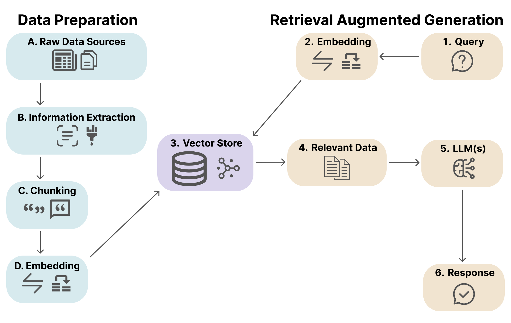

# Usage

- [Preliminary Steps](#preliminary-steps)
- [Startup](#startup)
- [Generate Domains](#generate-domains)
- [Options](#options)
    - [Data Loader](#data-loader)
    - [Chunking Strategy](#chunking-stragegy)
    - [Embedding Model](#embedding-model)
    - [Vector Store](#vector-store)
    - [Similarity Top K](#similarity-top-k)
    - [LLM Model](#llm-model)
    - [Mode](#mode)
    - [Github Repository](#github-repository)

---



## Preliminary Steps

Make sure the setup steps in the [Installation and Setup](./installation.md) documentation are complete.

## Startup

From within the `rag/` directory, start the project like so: 

```bash
(env) python main.py
```

On startup, you will be prompted to choose some configuration options. More details on the specifics of each option are documented in the [Options](#options) section.

## Generate Domains

After your configurations selections are confirmed, you'll be asked which domain you would like to generate. You can enter either the one letter shortcode for each domain or the full domain name. A new output subdirectory will be created in the `output/` directory named after the PDF file. Each domain will have at least one output file on each generation. The code will attempt to serialize the return response into a valid JSON object and if successful, will dump the JSON object in a file called `<selected_domain>_domain.json`. Regardless if the JSON serialization succeeds, the raw return response will be dumped in a text file with the file name format of `<selected domain>_domain.txt`. If you re-run the same domain multiple times in the same run instance, the output files will be overwritten with the latest generated response for that domain.

## Options

The option picker interface can be navigated with the `n` or `down arrow` keys for the next option, `p` or `up arrow` key for the previous option, and the `Enter` key to choose the option. If you choose the `Exit` option at any step in the process the program will exit with a status code of `0`.

### Data Loader

The data loader (or Reader) is one of the key abstraction concepts in the LlamaIndex library. Data loaders handle the data ingestion and formatting into Document objects, which will eventually be chunked into Node objects by the vector store. At a high level, Documents are a generic container for the data source. By default, Documents store the text (and/or images) from the data source, a dictionary of annotations containing the metadata, and a dictionary of relationships to other Documents and Nodes. A Node represents a "chunk" of a source Document. 

Aside from the built in generic data loaders, LLamaIndex hosts an open source [hub](https://llamahub.ai/?tab=readers) for various community built data loaders for a variety of data sources. Different data loaders differ in how they create and structure the resulting Documents. Depending on the specialization of the data loader in relation to the structure of the raw data source, this can have a significant impact on the overall performance of the downstream pipeline steps.

The currently supported data loaders are:

- `SimpleDirectoryReader` (default): This is a built-in data loader provided directly by the LlamaIndex library. It is the most generic option and is not specialized in any specific file type.
- `PDFReader`: This is an external data loader from LlamaHub that is specialized to PDF files. Because this is an external reader, there will be some overhead the first time you choose this option as the loader will have to be downloaded. Once downloaded, future runs with this option will not incur the download overhead. If this option is chosen, you will see command line ouptut checking if the dependency requirements are satisfied. 

### Chunking Strategy

The chunking strategy is the specific technique to split the Documents into Nodes. The chunking strategy chosen should influence downstream configuration choices, specifically the embedding model and similarity top k parameter selections. Recent research has shown that chunking optimization in RAG systems can have more of an impact on performance then most other parameter configurations, making it one of the most important configuration options. There are two general chunking strategies that this tool currently supports: fixed sized chunking and semantic chunking. 

Fixed size chunking strategies involve pre-setting the `chunk_size` and `chunk_overlap` parameters. The `chunk_size` controls the granularity of the chunks (or Nodes) by setting the token limit per chunk. For example, a chunk size of `256` will create more granular chunks, and as a result, more Nodes. However, vital information might not be among the top retrieved chunks, especially if the `similarity-top-k` parameter is not scaled accordingly. Conversly, a chunk size of `2048` is more likely to encompass relevant information at the cost of increased noise and a loss of specificity. With fixed size chunking stragies, it is important to scale the `similarity-top-k` parameter appropriately and to choose an embedding model that both supports (and performs well on) the chosen chunk size.

The semantic chunking supported by this tool involves using a semantic splitter to adaptively pick the breakpoint in-between sentences using embedding similarity. This ensure sthat a chunk contains sentences that are semantically related to each other. Note, semantic chunking introduces non-trival overhead in terms of computational resources and API calls. Especially for very large documents, expect worse runtime performance. There is also a possibility that the semantic splitter creates chunks that are too large for your chosen embedding model. While this bug is not specically addressed right now, it will probably have to be addressed with a custom second level safety net splitter eventually.

The currently supported chunking strategies are:

- `256 chunk size/20 chunk overlap`: Fixed chunking strategy with 256 tokens and a 20 token overlap between chunks.
- `512 chunk size/50 chunk overlap`: Fixed chunking strategy with 512 tokens and a 50 token overlap between chunks.
- `1024 chunk size/20 chunk overlap` (default): Fixed chunking strategy with 1024 tokens and a 20 token overlap between chunks. 
- `2048 chunk size/50 chunk overlap`: Fixed chunking strategy with 2048 tokens and a 50 token overlap between chunks.
- `semantic`: Semantic chunking based on adaptive chunk splitting.

### Embedding Model

The embedding model is responsible for converting the text into a numerical representation, or embedding. The embedding model is used to transform both the query and the chunked nodes into embeddings which are then compared to find the most similar nodes relating to the query during the information retrieval process. Different embedding models can significantly impact the performance of the RAG pipeline. Additionally, different embedding models perform optimally on different chunk sizes, so the embedding model choice should ideally be harmonized with the chosen chunking strategy. 

The currently supported embedding models are: 

- `text-embedding-3-small` (default): This is one of OpenAI's newest embedding models, designed for highly efficient embedding.
- `text-embedding-3-large`: This is the other new OpenAI embedding model, designed for maximum performance with support for embeddings up to 3,072 dimensions.
- `text-embedding-ada-002`: This is an older OpenAI embedding model, generally not recommended outside testing purposes as it is less efficient and less powerful than both the `text-embedding-3-small` and `text-embedding-3-large` models.

Currently, only OpenAI embedding models are supported. Futher documentation on the embedding models can be found [here](https://platform.openai.com/docs/guides/embeddings/what-are-embeddings) and information on pricing can be found [here](https://openai.com/pricing).

### Vector Store

The vector store handles the indexing, retrieval, and storage process. The indexing process is the method by which a vector store chunks, embeds, organizes, and stores the resulting embeddings of the chunked documents in the vector store. This process can vary depending on the specific implementation of the vector store chosen. The specific chunking strategy chosen can have a significant impact on the retrieval process and effects your embedding model choice (different embedding models perform optimally on different chunk sizes). The retrieval process first converts the query into a vector embedding and then performs a dense search operation to rank all the embeddings by how semantically similar they are to the query. Once the ranking is complete, the vector store returns, or retrieves, the most similar embeddings. The number of chosen retrievals to send to the LLM is controlled by the `similarity_top_k` parameter. Different vector stores also support different metadata filtering methods that allow for filtering the candidate set of documents based on certain metadata before performing the semantic search. 

Aside from the built in generic vector stores, LLamaIndex hosts an open source [hub](https://llamahub.ai/?tab=readers) for various other vector store options.

The currently supported vector stores are:

- `VectorStoreIndex` (default): This is the default built-in vector store provided directly by the LlamaIndex library. While it does support metadata filtering, by default it does not perform any metadata filtering.

### Similarity Top K

The `similarity_top_k` parameter in the similarity search process refers to the number of nodes to return as a result of the semantic retrieval process. When the semantic search process is performend, the node embeddings are ranked by how smenatically similar they are to the query embedding. After the ranking process is completed, the top `k` most similar embeddings are sent to the LLM along with the query. Larger values will result in more input tokens.

Note: The `similarity_top_k` parameter here is unrelated to the `top k` parameter for large language models which limits the model's vocabulary sampling set when considering the next word to generate.

### LLM Model

The currently supported LLM models are:

- `gpt-3.5-turbo`: This is the least powerful model, offering the fastest performance at a low cost with the caveat of being the least powerful of the OpenAI offerings.
- `gpt-4-turbo` (default): This is the default model and is OpenAI's newest offering. As of writing, this model currently points to the `gpt-4-turbo-2024-04-09` model.
- `gpt-4-turbo-preview`: As of writing, this model currently points to the `gpt-4-0125-preview` model. Generally not recommended outside of testing purposes as the `gpt-4-turbo` offers better performance at the same cost.
- `gpt-4`: This is the most powerful model, but also the most expensive.

Currently, only OpenAI LLM models are supported. Futher documentation on the specific LLM models can be found [here](https://platform.openai.com/docs/models/overview) and information on pricing can be found [here](https://openai.com/pricing).

### Mode

The mode option has no effect on the RAG performance, but controls how much extra information is included in the run log. Choosing the `debug` mode will include an extensive logging of everything that is happening during each run. Choosing the `production` mode will only include the necessary logging, such as the user options and return responses.

### Github Repository

After choosing the configuration options, you have the choice to also include a Github repository URL to include in the indexing process. The URL provided will automatically be parsed for the repository owner and repository name information. This will supplement the PDF data ingestion to provide more specific output for workflow specific steps in the description and parametric domains. 
