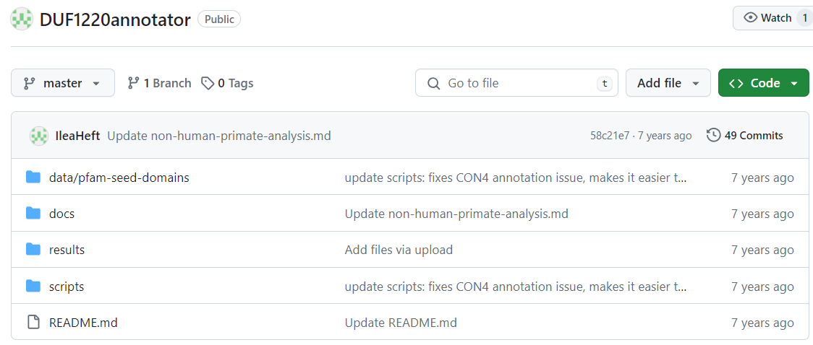
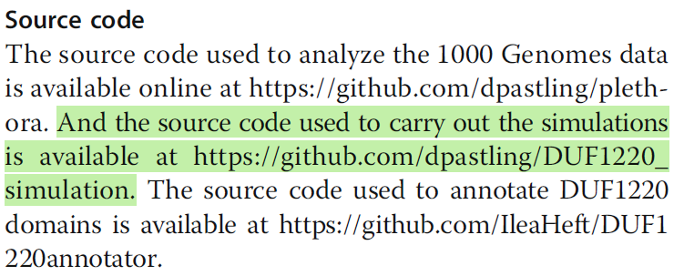

# High Resolution Measurement Paper

**NOTE**: These output results are outdated. The tool feature set has been updated since these results were generated.

- [Usability Domain](#usability-domain)
- [Description Domain](#description-domain)
- [Execution Domain](#execution-domain)
- [IO Domain](#io-domain)
- [Error Domain](#error-domain)

The configuration options for these outputs are as follows:

- Loader: `PDFReader`
- Embedding model: `text-embedding-3-small`
- Vector store: `VectorStoreIndex`
- LLM: `gpt-4-turbo`
- Mode: `debug`

Notes: 
- The generated outputs will vary on a per-run basis. You may get better or worse results depending on a variety of factors.
- The LLM struggles with filling in the `access_time` field defined in the `uri` field definition. 
    - It fills in a default value of November 1st, 2023 (`2023-11-01T12:00:00Z`).
- Due to the nature of a RAG, the knowledge retrieval is restricted to only the information explicitly provided in the paper.
    - If the field requires knowledge that is contained outside of the paper, the RAG will not provide specific responses.
    - As we'll see throughout this output analysis, the RAG approach is adept at identifying the correct repositories used and referenced in the paper but it will not be able to explore the repository further than the provided links.
    - For example, if a step in the `description_domain` requires for the exact link to the script within the repository, the generated response will only contain the overall repository URI, not the specific URI to the script within the repository.

## Usability Domain

#### Generated Domain:

```json
[
  "Develop and validate a computational whole-genome sequencing strategy to estimate copy numbers of DUF1220 domains at the clade, gene, and domain level, enabling the exploration of biological variations and potential disease associations linked to DUF1220 changes in specific NBPF genes."
]
```

#### Paper comaprison:

Notes: Given that the usability domain is a free text response that requires the least amount of contextual, domain specific knowledge, the usability domain tends to be the most accurate generated domain.


## Description Domain

#### Generated Domain:

```json
{
    "keywords": [
        "DUF1220",
        "gene copy number",
        "next-generation sequencing",
        "human genome",
        "genomic analysis"
    ],
    "pipeline_steps": [
        {
            "step_number": 1,
            "name": "Data Retrieval",
            "description": "Download sequence data from the 1000 Genomes Project",
            "input_list": [],
            "output_list": [
                {
                    "uri": "ftp://ftp.sra.ebi.ac.uk/vol1/fastq",
                    "access_time": "2023-11-01T12:00:00Z"
                }
            ]
        },
        {
            "step_number": 2,
            "name": "Data Annotation",
            "description": "Annotate DUF1220 domains using custom software",
            "input_list": [
                {
                    "uri": "https://github.com/IleaHeft/DUF1220annotator",
                    "access_time": "2023-11-01T12:00:00Z"
                }
            ],
            "output_list": [
                {
                    "uri": "https://github.com/IleaHeft/DUF1220annotator/output",
                    "access_time": "2023-11-01T12:00:00Z"
                }
            ]
        },
        {
            "step_number": 3,
            "name": "Simulation",
            "description": "Perform simulations to predict gene copy number variations",
            "input_list": [
                {
                    "uri": "https://github.com/dpastling/DUF1220_simulation",
                    "access_time": "2023-11-01T12:00:00Z"
                }
            ],
            "output_list": [
                {
                    "uri": "https://github.com/dpastling/DUF1220_simulation/output",
                    "access_time": "2023-11-01T12:00:00Z"
                }
            ]
        }
    ]
}
```

#### Paper Comaprison:

```json
{
    "keywords": [
        "DUF1220",
        "gene copy number",
        "next-generation sequencing",
        "human genome",
        "genomic analysis"
    ]
}
```

Notes: Grabs a solid starting point list of keywords. Missing some important ones listed by the authors, would be nice if "bioinformatics" and "copy number variation" were captured.


```json
{
    "step_number": 1,
    "name": "Data Retrieval",
    "description": "Download sequence data from the 1000 Genomes Project",
    "input_list": [],
    "output_list": [
        {
            "uri": "ftp://ftp.sra.ebi.ac.uk/vol1/fastq",
            "access_time": "2023-11-01T12:00:00Z"
        }
    ]
}
```

Notes: It does grab the correct FTP URL and identifies the correct initial project workflow step. However, it places the 1000 Genomes Project FTP link in the `output_list` instead of the `input_list`.

<p align="center">
    
</p>

```json
{
    "step_number": 2,
    "name": "Data Annotation",
    "description": "Annotate DUF1220 domains using custom software",
    "input_list": [
        {
            "uri": "https://github.com/IleaHeft/DUF1220annotator",
            "access_time": "2023-11-01T12:00:00Z"
        }
    ],
    "output_list": [
        {
            "uri": "https://github.com/IleaHeft/DUF1220annotator/output",
            "access_time": "2023-11-01T12:00:00Z"
        }
    ]
}
```

Notes: It correctly identifies the second step in the project workflow, the annotation step. It also correctly identifies the URL to the github repository that contains the source code for this step. However, the output URI is incorrect. The `output/` directory does not exist in the repository but is instead named `results/`. The URI to the repository is also not explicit about which file(s) are being processed as input, rather it just points to the repository as a whole.

<p align="center">
    
    
</p>



```json
{
    "step_number": 3,
    "name": "Simulation",
    "description": "Perform simulations to predict gene copy number variations",
    "input_list": [
        {
            "uri": "https://github.com/dpastling/DUF1220_simulation",
            "access_time": "2023-11-01T12:00:00Z"
        }
    ],
    "output_list": [
        {
            "uri": "https://github.com/dpastling/DUF1220_simulation/output",
            "access_time": "2023-11-01T12:00:00Z"
        }
    ]
}
```

Notes: Correctly identifies the simulation step and correctly identifies the repository URI. As with the previous step, the `output_list` URI is not real, there is no `output/` directory in the repository root.




## Execution Domain

#### Generated Domain

```json
{
    "script": [
        {
            "uri": {
                "uri": "https://github.com/dpastling/plethora",
                "access_time": "2023-11-01T12:00:00Z"
            }
        },
        {
            "uri": {
                "uri": "https://github.com/dpastling/DUF1220_simulation",
                "access_time": "2023-11-01T12:00:00Z"
            }
        },
        {
            "uri": {
                "uri": "https://github.com/IleaHeft/DUF1220annotator",
                "access_time": "2023-11-01T12:00:00Z"
            }
        }
    ],
    "script_driver": "shell",
    "software_prerequisites": [
        {
            "name": "Python",
            "version": "3.8",
            "uri": {
                "uri": "https://www.python.org/downloads/release/python-380/",
                "access_time": "2023-11-01T12:00:00Z"
            }
        },
        {
            "name": "R",
            "version": "4.0.2",
            "uri": {
                "uri": "https://cran.r-project.org/bin/windows/base/old/4.0.2/",
                "access_time": "2023-11-01T12:00:00Z"
            }
        }
    ],
    "external_data_endpoints": [
        {
            "name": "1000 Genomes Project",
            "url": "ftp://ftp.sra.ebi.ac.uk/vol1/fastq"
        }
    ],
    "environment_variables": {
        "GENOME_DATA_PATH": "/path/to/genome/data",
        "SIMULATION_OUTPUT_PATH": "/path/to/simulation/output"
    }
}
```

#### Paper Comparison

```json
{
    "script": [
        {
            "uri": {
                "uri": "https://github.com/dpastling/plethora",
                "access_time": "2023-11-01T12:00:00Z"
            }
        },
        {
            "uri": {
                "uri": "https://github.com/dpastling/DUF1220_simulation",
                "access_time": "2023-11-01T12:00:00Z"
            }
        },
        {
            "uri": {
                "uri": "https://github.com/IleaHeft/DUF1220annotator",
                "access_time": "2023-11-01T12:00:00Z"
            }
        }
    ]
}
```

Notes: The corect repositories are identified, but the specific scripts within the repositories are not.


```json
{
    "script_driver": "shell",
    "software_prerequisites": [
        {
            "name": "Python",
            "version": "3.8",
            "uri": {
                "uri": "https://www.python.org/downloads/release/python-380/",
                "access_time": "2023-11-01T12:00:00Z"
            }
        },
        {
            "name": "R",
            "version": "4.0.2",
            "uri": {
                "uri": "https://cran.r-project.org/bin/windows/base/old/4.0.2/",
                "access_time": "2023-11-01T12:00:00Z"
            }
        }
    ]
}
```

Notes: The `software_prerequisites` and versions are inferred by the LLM. While Python and R are required to run the various steps in the repositories, there are additional dependencies described in each repository's respective README files, such as `HMMER 3.1b2`, `MAFFT 7.245`, `Bowtie2`, `Bedtools`, `Samtools`, and more. Since these are not explicitly described in the paper, the RAG will not be able to be specific here.

```json
{
    "external_data_endpoints": [
        {
            "name": "1000 Genomes Project",
            "url": "ftp://ftp.sra.ebi.ac.uk/vol1/fastq"
        }
    ],
    "environment_variables": {
        "GENOME_DATA_PATH": "/path/to/genome/data",
        "SIMULATION_OUTPUT_PATH": "/path/to/simulation/output"
    }
}
```

Notes: The `external_data_endpoints` data is correctly identified as the source `1000 Genomes Project` data. The `environment_variables` here are inferred and not exact. This information is only described in each repository's documentation.

## IO Domain

#### Generated Domain

```json
{
    "input_subdomain": [
        {
            "uri": {
                "filename": "1000_Genomes_data",
                "uri": "ftp://ftp.sra.ebi.ac.uk/vol1/fastq",
                "access_time": "2023-11-01T12:00:00Z"
            }
        }
    ],
    "output_subdomain": [
        {
            "mediatype": "application/octet-stream",
            "uri": {
                "filename": "DUF1220_domain_annotations",
                "uri": "https://github.com/IleaHeft/DUF1220annotator",
                "access_time": "2023-11-01T12:00:00Z"
            }
        },
        {
            "mediatype": "application/octet-stream",
            "uri": {
                "filename": "DUF1220_protein_alignments",
                "uri": "https://github.com/dpastling/DUF1220_simulation",
                "access_time": "2023-11-01T12:00:00Z"
            }
        }
    ]
}
```

Notes: The IO domain here suffers from similar issues as described above.

## Error Domain

#### Generated Domain

This response could not be automatically serialized into JSON because the response included some supplementary text: 

```txt
The provided paper does not contain specific information that fits into the empirical or algorithmic error domains as defined in the JSON schema. Therefore, both subdomains are returned as empty objects.
```
